**This profile runs as an agent session — scroll through the calls.**
I build AI-powered applications and automations for the web.
Application Developer in training (IHK) · 15+ years of leadership experience · Hamburg

 

I'm currently completing a two-year retraining program as a **Fachinformatiker für Anwendungsentwicklung (IHK)** — a certified German application developer track — with a focus on **AI-assisted software solutions** and modern web development.

Before switching to software, I spent **15+ years in leadership roles**. That background shapes how I work: I think in outcomes, communicate clearly, and take ownership of what I ship. My goal is to combine that experience with engineering skills to build **agent systems and automations that solve real business problems**.

- 🔭 Currently building: AI agent workflows with Claude, MCP and Python
- 🌱 Currently deepening: TypeScript, Next.js, and production-grade AI integrations
- 💬 Ask me about: prompt engineering, AI tooling, or leading teams

 

| Project | Stack | What it demonstrates | |
|---|---|---|---|
| **[Iron Fortress](https://github.com/B-Riemer/iron-fortress-system)** | Next.js · Tailwind v4 · Supabase · Stripe | Full-stack SaaS architecture: auth, database design, and real payment integration | [↗ Live](https://iron-fortress-system.vercel.app) |
| **[PCAP Trainer](https://github.com/B-Riemer/pcap-trainer-web)** | Next.js 15 · TypeScript · SQLite | Self-built exam trainer for the PCAP certification — question bank, scoring, persistence | [↗ Live](https://pcap-trainer-web.vercel.app) |
| **[Cyberpunk Portfolio Hub](https://github.com/B-Riemer/cyberpunk-portfolio-hub)** | Next.js 16 · TypeScript | Modern App-Router patterns, interactive UI, and deployment pipeline | [↗ Live](https://b-riemer.github.io/cyberpunk-portfolio-hub/) |
| **[React Chatbot](https://github.com/B-Riemer/React-Chatbot-Project)** | React · JavaScript | Conversational UI and API state handling | |

> Each project README documents architecture decisions, trade-offs and lessons learned — not just setup steps.

 

 

| | Certification | Issuer |
|---|---|---|
| 🐍 | **PCAP — Certified Associate in Python Programming** | Python Institute |
| ☁️ | **AWS Certified Cloud Practitioner** | Amazon Web Services |
| 🔄 | **PSM I — Professional Scrum Master** | Scrum.org |
| ☕ | **Oracle Java Foundations** | Oracle |

 

I'm open to conversations about **AI development, automation projects, internships and junior positions** (available from my IHK graduation).

**🌐 Website:** [b-riemer.dev](https://b-riemer.dev) · **✉️ Email:** [ai@b-riemer.dev](mailto:ai@b-riemer.dev) · **💼 LinkedIn:** [/in/b-riemer](https://www.linkedin.com/in/b-riemer/)

 

<b>🇩🇪 Profil auf Deutsch lesen</b>

 

Ich absolviere aktuell eine zweijährige Umschulung zum **Fachinformatiker für Anwendungsentwicklung (IHK)** mit Fokus auf **KI-gestützte Softwarelösungen** und moderne Webentwicklung.

Davor: **über 15 Jahre Führungserfahrung**. Diese Erfahrung prägt meine Arbeitsweise — ich denke in Ergebnissen, kommuniziere klar und übernehme Verantwortung für das, was ich baue. Mein Ziel: Führungserfahrung und Engineering kombinieren, um **Agent-Systeme und Automatisierungen mit echtem Business-Nutzen** zu bauen.

- 🔭 Aktuell: KI-Agenten-Workflows mit Claude, MCP und Python
- 🌱 Vertiefe gerade: TypeScript, Next.js und produktionsreife KI-Integrationen
- 💬 Sprich mich an zu: Prompt Engineering, KI-Tooling oder Teamführung

**Offen für:** Gespräche über KI-Projekte, Praktika und Junior-Positionen (verfügbar ab IHK-Abschluss).

**🌐 Website:** [b-riemer.dev](https://b-riemer.dev) · **✉️ E-Mail:** [ai@b-riemer.dev](mailto:ai@b-riemer.dev) · **💼 LinkedIn:** [/in/b-riemer](https://www.linkedin.com/in/b-riemer/)

 

✦ session persisted · exit code 0 — every SVG hand-crafted, no generators used

